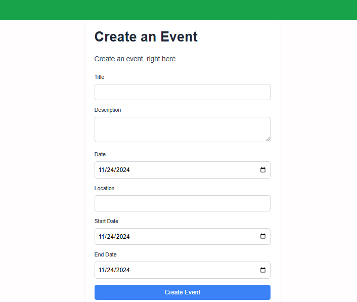

## Event Management System FrontEnd 

First, run the development server:

```bash
npm run dev
```

Open [http://localhost:3000](http://localhost:3000) with your browser to see the following result.
## Landing or the first page of an event management system
  - We can see the upcoming events with banner and event description
  - There is an action which can be able to register for the event
  - Also the system automatically reminder the registered user via his/her email address

## Create an event 
  - Anyone can be able to create an event by filling the fields on the form


## Register your self for the event 
  - Anyone can be able to attend to the event through filling the form here


## Dockerfile
- we can contenerize the application using the following written dockerfile
```sh
# Use a lightweight Node.js image
FROM node:18-alpine AS base

# Install dependencies only when needed
FROM base AS deps
RUN apk add --no-cache libc6-compat
WORKDIR /app

# Copy the package manager lock files
COPY package.json yarn.lock* package-lock.json* pnpm-lock.yaml* ./
RUN \
  if [ -f yarn.lock ]; then yarn install --frozen-lockfile; \
  elif [ -f package-lock.json ]; then npm ci --legacy-peer-deps; \
  elif [ -f pnpm-lock.yaml ]; then corepack enable pnpm && pnpm install --frozen-lockfile; \
  else echo "Lockfile not found." && exit 1; \
  fi

# Rebuild the source code only when needed
FROM base AS builder
WORKDIR /app
COPY --from=deps /app/node_modules ./node_modules
COPY . .

# Build the Nuxt application
RUN \
  if [ -f yarn.lock ]; then yarn build; \
  elif [ -f package-lock.json ]; then npm run build; \
  elif [ -f pnpm-lock.yaml ]; then corepack enable pnpm && pnpm run build; \
  else echo "Lockfile not found." && exit 1; \
  fi

# Production image
FROM node:18-alpine AS runner
WORKDIR /app

ENV NODE_ENV production

# Create a non-root user for security
RUN addgroup --system --gid 1001 nodejs && adduser --system --uid 1001 nuxtjs

# Copy necessary files from the builder
COPY --from=builder /app/.output ./.output
COPY --from=builder /app/node_modules ./node_modules
COPY --from=builder /app/package.json ./

USER nuxtjs

EXPOSE 3000

ENV PORT 3000
ENV HOSTNAME "0.0.0.0"

# Verify the server directory
RUN ls -la .output/server

# Start the Nuxt server using the output directory
CMD ["node", ".output/server/index.mjs"]

```
## Go to Backend
- **Go to Backend respository**: [https://github.com/gama1221/event-backend-node-ts](https://github.com/gama1221/event-backend-node-ts)

## Frontend Technologies
- NextJs
- Typescript
- Nodejs
- Docker for contenerization
## 📫 Contact Me
- **Portfolio**: [[Getinet Amare](https://getinet.netlify.app/)](https://getinet.netlify.app/)
- **Email**: [getinetamare@gmail.com](mailto:getinetamare@gmail.com)  
- **LinkedIn**: [linkedin.com/in/getinet-mekonnen](linkedin.com/in/getinet-mekonnen)  
- **GitHub**: [github.com/gama1221](github.com/gama1221)  
